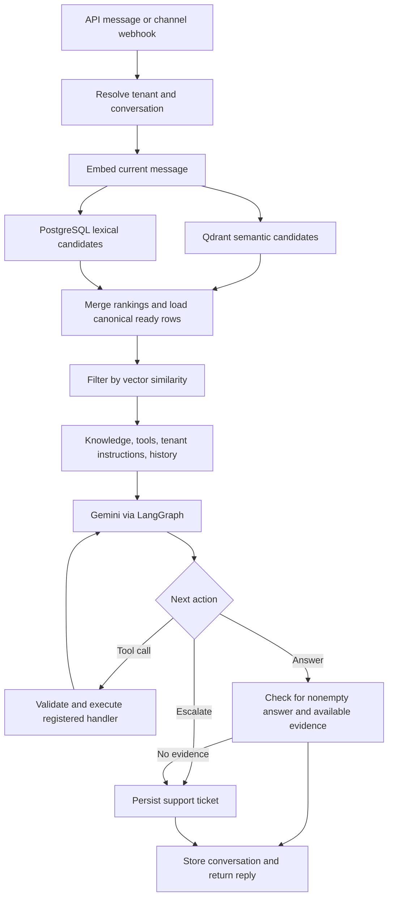

# Context Agent — codebase review

Reviewed: 15 September 2026. Scope: `/Users/muthuraman/Desktop/context-agent`.

## Assessment

This is a compact, functional backend for a multi-tenant customer-support assistant. It turns business facts into searchable knowledge, answers questions with Gemini, remembers identified customers, and opens support tickets when it cannot answer. WhatsApp, Instagram, and Telegram share the same agent.

The knowledge-storage and tool-registry boundaries are thoughtfully implemented. The current channel-delivery implementation has serious correctness problems, however, and passing unit tests do not establish readiness for public multi-tenant use.

I read all 19 application modules (2,413 lines), all 14 test files (1,422 lines), five migration revisions plus their environment, the API client script, project/deployment configuration, and the four existing Markdown documents. I inspected dependency declarations and parsed the lockfile. Application code, migrations, configuration, and existing tests were not changed. This report is the only repository addition.

### Verification

| Check | Result |
|---|---|
| Ruff over application, tests, migrations, and scripts | Passed |
| Existing pytest suite | 65 passed; four dependency/local-engine warnings |
| Alembic upgrade to head, offline SQL generation | Passed; five revisions, 159 lines of generated SQL |
| Additional isolated review probes | 13 passed, confirming the behaviors described below |

The additional probes assert the **current problematic behavior**; their passing does not mean these bugs are fixed. They use temporary SQLite databases, fake models, and intercepted channel sends. The notification cancellation probe uses a shortened timeout to exercise the same cancellation path quickly.

Probe file: [test_context_agent_review.py](/private/tmp/test_context_agent_review.py).

Reproduce from the project directory:

```sh
.venv/bin/pytest -q -s /private/tmp/test_context_agent_review.py -o asyncio_mode=auto
```

No live Gemini calls, social messages, production database changes, or running-stack mutation tests were performed. PostgreSQL locking, live full-text search, hosted Qdrant behavior, real model accuracy, deployment compatibility, and dependency vulnerability status remain unverified. Offline migration generation does not prove that a live database upgrade succeeds.

## 1. Features actually implemented

| Feature | Current behavior | Main implementation |
|---|---|---|
| Tenant knowledge document | One document per tenant; PUT replaces all knowledge while preserving document ID | [knowledge.py](/Users/muthuraman/Desktop/context-agent/src/context_agent/knowledge.py:44) |
| Knowledge extraction | Structured model output produces up to 100 self-contained units; unclear input receives clarification | [knowledge.py](/Users/muthuraman/Desktop/context-agent/src/context_agent/knowledge.py:10) |
| Add knowledge | POST adds new units without changing existing units | [knowledge.py](/Users/muthuraman/Desktop/context-agent/src/context_agent/knowledge.py:96) |
| Natural-language updates | PATCH retrieves candidates, asks the model for edits, validates target IDs, preserves stable IDs, and re-embeds changed content | [knowledge.py](/Users/muthuraman/Desktop/context-agent/src/context_agent/knowledge.py:118) |
| Hybrid retrieval | Qdrant semantic search plus PostgreSQL full-text search; reciprocal-rank fusion combines rankings; cosine filtering selects relevant candidates | [retrieval.py](/Users/muthuraman/Desktop/context-agent/src/context_agent/retrieval.py:16) |
| Agent control flow | LangGraph retrieves context, invokes the model, executes tools, then answers or escalates | [agent.py](/Users/muthuraman/Desktop/context-agent/src/context_agent/agent.py:31) |
| Tool infrastructure | Code-defined handlers, JSON-schema validation, stable IDs, shared/tenant scopes, synchronization, and bounded execution | [tools.py](/Users/muthuraman/Desktop/context-agent/src/context_agent/tools.py:30) |
| Support tickets | Durable, idempotent creation by tenant/request; list, view, resolve, reopen, and staff notes | [support.py](/Users/muthuraman/Desktop/context-agent/src/context_agent/support.py:26) |
| External support notification | Optional best-effort HTTP notification after ticket persistence | [tools.py](/Users/muthuraman/Desktop/context-agent/src/context_agent/tools.py:43) |
| Conversation memory | Reuses a conversation identified by tenant, channel, and external user; replays ten messages by default | [conversations.py](/Users/muthuraman/Desktop/context-agent/src/context_agent/conversations.py:19) |
| Tenant instructions | GET/PUT business instructions; injected into every answer prompt | [instructions.py](/Users/muthuraman/Desktop/context-agent/src/context_agent/instructions.py:11) |
| Social channels | Inbound text parsing, Meta signature checks/challenges, Telegram secret checks, account routing, and outbound replies | [channels.py](/Users/muthuraman/Desktop/context-agent/src/context_agent/channels.py:65), [webhooks.py](/Users/muthuraman/Desktop/context-agent/src/context_agent/webhooks.py:90) |
| Usage and timing | API response token accounting; missing counts remain explicitly unknown; chat response timing | [usage.py](/Users/muthuraman/Desktop/context-agent/src/context_agent/usage.py:22) |
| Startup and repair | Wait for storage, migrate, initialize indexes, recover missing/pending knowledge vectors, sync tools, start API | [bootstrap.py](/Users/muthuraman/Desktop/context-agent/src/context_agent/bootstrap.py:57) |
| Maintenance and client | Initialize/reconcile/sync/register-channel CLI; standard-library API client | [cli.py](/Users/muthuraman/Desktop/context-agent/src/context_agent/cli.py:77), [call_api.py](/Users/muthuraman/Desktop/context-agent/scripts/call_api.py:28) |

**Only one executable tool is currently registered: `create_support_ticket`.** The framework supports more tools, but bookings, order lookups, payments, CRM actions, and other business integrations are not implemented in this repository. See [REGISTRY](/Users/muthuraman/Desktop/context-agent/src/context_agent/tools.py:100).

### API inventory

Tenant endpoints use `/api/v1/tenants/{tenant_id}`:

| Method | Suffix | Purpose |
|---|---|---|
| PUT | `/document` | Create/replace document |
| POST | `/document/knowledge-units` | Add knowledge |
| PATCH | `/document/knowledge-units` | Update knowledge |
| POST | `/agent/messages` | Ask the assistant |
| GET | `/support-tickets` | List tickets, optionally filter status |
| GET / PATCH | `/support-tickets/{ticket_ref}` | Read/update ticket |
| GET / PUT | `/instructions` | Read/replace tenant instructions |

Also implemented: GET `/health/live`, GET `/health/ready`, and GET/POST `/webhooks/{channel}`. There is no frontend in this repository.

## 2. Architecture and data flow



Default retrieval settings are 30 candidates per search source, four knowledge units, five retrieved tools, cosine threshold 0.60, and two tool rounds. One query embedding is reused for knowledge and tool searches. A normal answer requires one logical chat call; the configured tool loop permits up to three. Provider retries add work beyond this logical limit.

The configured provider defaults are `gemini-3.5-flash` for chat and `gemini-embedding-2` with 3,072 dimensions for embeddings. These are configuration facts; live model availability and quality were not tested.

### Storage

PostgreSQL has **nine tables**: `documents`, `knowledge_units`, `tools`, `conversations`, `messages`, `channel_accounts`, `webhook_events`, `support_tickets`, and `tenant_settings`. Qdrant has two prefixed collections for knowledge and tools. Vector payloads contain tenant IDs; content is loaded from PostgreSQL.

- **PUT:** extract/embed replacement units, stage fresh vector IDs, replace database rows in a locked transaction, then clean up old vectors.
- **POST:** extract/embed/add units while holding the tenant transaction.
- **PATCH:** validate edits, generate vectors, commit changed text as pending, then recheck hashes under a second tenant lock before publishing vectors and marking ready.
- **Repair:** reconciliation re-embeds canonical knowledge and deletes orphan vectors under the same tenant lock.

The staging and canonical-read checks prevent stale vectors from directly exposing deleted or other-tenant knowledge. PATCH intentionally sacrifices availability after a partial indexing failure: changed units stay hidden until repaired.

## 3. Confirmed defects, in priority order

P1 means a high-impact correctness issue to fix before relying on the affected feature. P2 means a narrower correctness issue. Deployment prerequisites and quality limitations are listed separately.

### 1. P1 — Mixed-account Meta batches use the first account's tenant

**Location:** [webhooks.py:116](/Users/muthuraman/Desktop/context-agent/src/context_agent/webhooks.py:116), [channels.py:70](/Users/muthuraman/Desktop/context-agent/src/context_agent/channels.py:70), [channels.py:125](/Users/muthuraman/Desktop/context-agent/src/context_agent/channels.py:125).

The endpoint resolves an account from only the first entry/change, verifies the raw body using that account, and passes the entire body to a worker with one tenant/config. Both adapters subsequently parse every entry. The normalized `Inbound` object does not retain the destination account.

**Reproduced:** signed synthetic batches containing accounts A and B caused both messages to run as tenant A, and both send attempts used account A's config. This occurred for both WhatsApp and Instagram.

**Impact:** a mixed-account payload can select the wrong tenant's knowledge and tools, persist the conversation under the wrong tenant, and attempt a reply through the wrong business account. Actual external delivery was not attempted; provider rejection could prevent a wrong-account send from succeeding.

**Fix:** retain each event's account routing key, verify the original signed body with the appropriate app credentials, then resolve and process each account's messages separately. Reject or safely isolate entries that cannot be authorized for that account.

### 2. P1 — Telegram deduplication drops unrelated messages

**Location:** [channels.py:188](/Users/muthuraman/Desktop/context-agent/src/context_agent/channels.py:188), [webhooks.py:59](/Users/muthuraman/Desktop/context-agent/src/context_agent/webhooks.py:59), [db.py:129](/Users/muthuraman/Desktop/context-agent/src/context_agent/db.py:129).

Telegram `message_id` is unique within a chat, while storage deduplicates globally by `(channel, event_id)`. The request UUID also derives only from channel and message ID. Telegram documents the chat-local scope and provides an update identifier for webhook deduplication. [Telegram Message](https://core.telegram.org/bots/api#message), [Telegram Update](https://core.telegram.org/bots/api#update).

**Reproduced:** chat 111 and chat 222 sent distinct updates with message ID 7. Only chat 111 was processed. This happened both within one tenant and across two tenants.

**Fix:** identify deliveries using a stable channel-account ID plus Telegram `update_id`, or a properly scoped account/chat/message identity. Use the same scoped identity for database uniqueness, request IDs, and retry handling. Do not use the rotating webhook secret as the permanent account identity.

### 3. P1 — Failed webhook processing is permanently treated as complete

**Location:** [webhooks.py:59](/Users/muthuraman/Desktop/context-agent/src/context_agent/webhooks.py:59), [webhooks.py:79](/Users/muthuraman/Desktop/context-agent/src/context_agent/webhooks.py:79), [webhooks.py:127](/Users/muthuraman/Desktop/context-agent/src/context_agent/webhooks.py:127).

The event marker commits before request validation, model execution, or reply delivery. Subsequent failures are logged, but the marker remains. Any redelivery is skipped. The HTTP acknowledgement precedes durable job persistence, and background work lives only in the server process.

**Reproduced:** injected model failure followed by redelivery produced one agent attempt and zero sends. Injected send failure followed by redelivery produced only one send attempt.

**Fix:** persist an inbound job before acknowledging, track pending/processing/completed/failed state, and persist outbound replies for retry. Separate retrying a failed send from rerunning tools. Simply removing deduplication would introduce duplicate side effects.

### 4. P1 — The request timeout does not stop the handler

**Location:** [api.py:112](/Users/muthuraman/Desktop/context-agent/src/context_agent/api.py:112).

`asyncio.timeout` wraps `call_next` inside HTTP middleware. In the installed Starlette implementation, the downstream app runs in a separate task, which continues after this timeout. Body reading also occurs before the timeout starts.

**Reproduced:** with a 10 ms deadline and a handler that performed an effect after 70 ms, the response was 502 with approximately 11 ms reported duration, but the late effect still happened. The in-process ASGI call completed after roughly 74 ms. A real network client may receive the error earlier while the work continues.

**Impact:** timed-out requests can continue consuming provider quota, occupying connections, and mutating state. Usage captured at error-response time can omit later work.

**Fix:** enforce cancellation at the service coroutine or complete ASGI task boundary, include body-read deadlines, and define idempotency for operations that may already have committed. Add a test asserting that cancellable work actually stops.

### 5. P2 — Invalid model arguments disable the deterministic support fallback

**Location:** [agent.py:155](/Users/muthuraman/Desktop/context-agent/src/context_agent/agent.py:155), [agent.py:189](/Users/muthuraman/Desktop/context-agent/src/context_agent/agent.py:189).

Any model-selected support call marks the graph escalated, even when argument validation fails. Escalation reuses the failed result merely because a previous support call exists, so it never tries the valid arguments it can construct itself.

**Reproduced:** omitting `reason` yielded `escalation_failed` and zero tickets with healthy storage.

**Fix:** distinguish argument-validation failures from confirmed ticket creation; recover using the deterministic tenant/request ticket identity and valid server-generated fallback arguments. Preserve uncertainty for arbitrary external tool side effects.

### 6. P2 — Notification timeout can hide a successfully created support ticket

**Location:** [tools.py:67](/Users/muthuraman/Desktop/context-agent/src/context_agent/tools.py:67), [tools.py:78](/Users/muthuraman/Desktop/context-agent/src/context_agent/tools.py:78), [tools.py:123](/Users/muthuraman/Desktop/context-agent/src/context_agent/tools.py:123).

Ticket creation and optional notification share the tool's 25-second budget. If that budget expires during notification, cancellation escapes the notification's `except Exception`; the outer executor returns failure despite the already committed ticket.

**Reproduced with a shortened budget:** one durable ticket existed while the tool returned `ok: false`.

**Fix:** make durable creation determine the success result. Move notification to an independently bounded outbox/worker, or recover the already-created ticket after cancellation before reporting its outcome.

### 7. P2 — Usage middleware breaks empty-body redirects

**Location:** [usage.py:102](/Users/muthuraman/Desktop/context-agent/src/context_agent/usage.py:102).

The middleware parses every `/api/` response body as JSON and then assumes it is a dictionary. FastAPI's trailing-slash redirects have empty bodies.

**Reproduced:** GET `/api/v1/tenants/a/instructions/` returned 502 instead of a redirect.

**Fix:** pass through redirects and responses without bodies; rewrite only supported JSON objects. Preserve response status and headers, and avoid assuming future streaming/file responses are JSON.

### 8. P2 — Accepted external user IDs exceed database column lengths

**Location:** [schemas.py:64](/Users/muthuraman/Desktop/context-agent/src/context_agent/schemas.py:64), [db.py:84](/Users/muthuraman/Desktop/context-agent/src/context_agent/db.py:84), [db.py:160](/Users/muthuraman/Desktop/context-agent/src/context_agent/db.py:160).

`external_user_id` uses `ShortText`, which accepts up to 500 characters. Conversation and ticket columns permit only 200.

**Verified:** the input schema accepted a 201-character ID; both database column definitions are length 200. PostgreSQL persistence will reject this input, while SQLite tests do not enforce that VARCHAR limit. A live PostgreSQL failure was not exercised.

**Fix:** align validation with storage and return a validation error before persistence, or deliberately widen both columns through a migration.

### 9. P2 — Pending tenant tool overrides allow the shared handler through

**Location:** [tools.py:170](/Users/muthuraman/Desktop/context-agent/src/context_agent/tools.py:170).

Override discovery first filters to ready rows. A tenant-specific override that is pending, failed, or out of sync therefore disappears from the override map, allowing a same-named shared tool to be selected.

**Reproduced:** a ready shared `lookup` plus a pending tenant `lookup` selected `shared.lookup` for that tenant.

**Fix:** establish override ownership from the code registry independently of readiness, then require the chosen tenant definition to be synchronized and relevant before making it available. This is latent in the shipped registry because it currently contains only the support tool.

## 4. Design, quality, and scale limitations

### Authentication is a prerequisite for public exposure

The API intentionally has no authentication or authorization. The URL determines the tenant, and the request body determines the conversation user. Anyone who can reach these routes can address another tenant's knowledge operations, instructions, and tickets; callers can also select another user's conversation identity.

This is an explicitly deferred scope item in [api-structure.md](/Users/muthuraman/Desktop/context-agent/api-structure.md:5), not an undisclosed implementation omission. Compose binds the exposed services to loopback for local development. Before publishing routes, derive tenant and user identity from a trusted authenticated principal, authorize staff operations, and apply rate/concurrency limits. Webhook signature validation does not protect the regular API.

### Conversation memory does not inform retrieval

[Agent.retrieve](/Users/muthuraman/Desktop/context-agent/src/context_agent/agent.py:57) embeds and searches only the newest message. History is appended afterward. A follow-up such as “How much was that again?” can lose its subject during retrieval.

A controlled probe confirmed that only this ambiguous sentence was embedded even though the prompt contained the prior consultation price. With no newly retrieved evidence, the agent escalated despite a model answer using the visible history. This establishes the control flow, not the real embedding model's failure rate.

Consider deriving a standalone search query from recent context and preserving provenance for prior facts/tool results. Avoid treating unverified previous assistant text as newly trusted evidence.

### Concurrent turns can read the same old history

[Agent.run](/Users/muthuraman/Desktop/context-agent/src/context_agent/agent.py:229) releases the tenant lock after loading history and reacquires it only after model execution. Two simultaneous turns in the same conversation can therefore reason from the same old history and persist in completion order. Sequence numbers prevent duplicate sequence values; they do not serialize the complete conversation turn. This is a code-path inference, not a live PostgreSQL concurrency test.

A per-conversation queue or turn reservation would preserve conversational order without making every user in a tenant wait for one model call. Repeated API request IDs also do not deduplicate conversation messages or general tools.

### Retrieval quality and factual support remain unmeasured

- Every candidate, including exact lexical matches, must pass the same cosine threshold. Exact codes, names, or policy phrases may be excluded even when lexical matching succeeds.
- Four knowledge units may omit conditions needed to answer multi-part questions.
- The same retrieval cutoff is used to discover knowledge-update targets.
- [Agent.finish](/Users/muthuraman/Desktop/context-agent/src/context_agent/agent.py:180) checks that some evidence exists; it does not check whether each answer claim is supported by that evidence.
- Extraction and updating rely on model instructions to preserve every exception. The original input summary is not stored separately for later comparison.
- The returned `knowledge_units` are supplied context, not verified citations. Prompt injection resistance and language matching are instructions, not established behavioral guarantees. Escalation messages are hardcoded in English.

Evaluate representative FAQs, contextual follow-ups, exact identifiers, multilingual inputs, conflicting policies, unsupported claims, and malicious instructions in retrieved text. Calibrate thresholds against those results rather than treating cosine scores as probabilities of correctness.

### Long tenant transactions limit throughput

[KnowledgeService.add](/Users/muthuraman/Desktop/context-agent/src/context_agent/knowledge.py:96) and update hold a tenant advisory lock across model and embedding calls. Retrieval and ticket operations also acquire this tenant lock. One ingestion or repair can therefore block unrelated conversations and staff operations for that tenant. Embeddings are generated sequentially, and model output may contain up to 100 units.

Move slow preparation outside short database critical sections where safe, with a final content/state recheck. Use bounded concurrency for provider work if supported by the chosen embedding contract. Measure pool occupancy, lock waits, request latency, and provider cost.

### Recovery, management, and channel coverage are limited

- Pending knowledge needs manual reconciliation or startup repair; no durable background retry worker exists.
- Knowledge POST retries can duplicate units. General chat/tool operations do not have response caching or comprehensive idempotency.
- Channel registration accepts an unvalidated JSON config. Missing send credentials are logged and treated as a completed send function, while the event remains claimed.
- Channel support covers inbound text. Media, richer interactions, delivery-status reconciliation, and response chunking are absent. Unknown accounts are acknowledged and discarded.
- Ticket listing loads every matching ticket without pagination, and usage middleware buffers the complete response.
- There are no document/knowledge browse or delete endpoints, conversation reset/history-management endpoints, or data-retention workflows.
- Channel credentials are stored directly in JSONB and supplied to the CLI as JSON text. Deployment needs deliberate secret storage, rotation, and log handling.
- Startup is explicitly designed for one local instance. Multi-instance migration coordination and rolling changes to tools/indexes are not established.
- There is no checked-in CI workflow, load-test suite, or representative model-evaluation dataset. API errors generally log exception types without enough structured request context for diagnosis.

### Documentation and client contracts need updating

- [README.md:97](/Users/muthuraman/Desktop/context-agent/README.md:97) says conversation history is not stored, but identified-user requests now persist it.
- [database-structure.md:3](/Users/muthuraman/Desktop/context-agent/database-structure.md:3) describes three tables; the application has nine.
- Channel setup and tenant instructions are missing from the main feature documentation.
- [ChatOutput](/Users/muthuraman/Desktop/context-agent/src/context_agent/schemas.py:81) says callers can reuse `conversation_id`, but `ChatInput` has no such field and forbids extra fields. Callers must actually reuse channel plus external user ID.
- The client script rejects empty `set-instructions` input, although the API permits an empty string to clear instructions. Its general 60,000-character input check also differs from the instruction endpoint's 20,000-character limit.

## 5. What the existing tests cover—and miss

The 65 tests cover basic API contracts, replacement consistency, pending updates after indexing failure, invalid update IDs, canonical tenant filtering, local Qdrant filtering, tool synchronization, support idempotency, sequential conversation replay, instructions, usage accounting, and basic webhook verification/deduplication.

The important gaps are multi-account webhook routing, Telegram identity collisions, retry after processing/send failure, cancellation semantics, PostgreSQL constraints/locks/full-text search, concurrent conversation turns, tool override transitions, live channel sends, model answer quality, and load behavior. The isolated probes confirmed several gaps without altering application code.

## 6. Recommended implementation order

1. Fix per-account webhook routing and Telegram event identity.
2. Persist inbound jobs and outbound replies with retry state; preserve tool idempotency.
3. Enforce actual request cancellation and body-read deadlines.
4. Fix support fallback/notification outcome handling, redirect handling, and external-ID validation.
5. Add authentication and tenant/user authorization before any public API exposure.
6. Add PostgreSQL integration checks, webhook failure tests, and per-conversation ordering tests to CI.
7. Improve contextual retrieval and evaluate factual accuracy, escalation quality, latency, and cost.
8. Shorten tenant lock duration; add pagination, retention, repair scheduling, and current documentation.

The next useful milestone is reliable handling of one tenant's messages end to end—including retries and failures—followed by a two-tenant channel isolation test. More business tools should follow those foundations.
